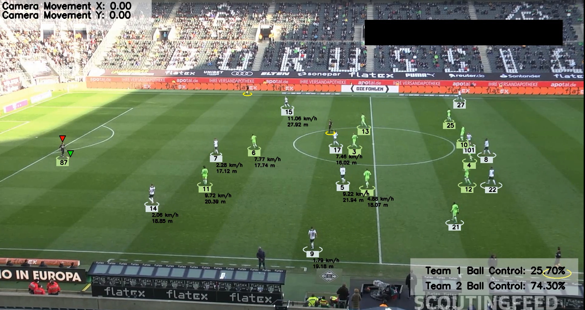

# **Tools and Libraries Used in Our Project**

<div style="display: flex; flex-wrap: wrap; gap: 10px;">
  
  
  
  
  
  
  
  
  
  
  
  
  

</div>

# Football Players Detection and Tracking

## Introduction
This project detects and tracks football players, referees, and the ball from video footage using advanced AI techniques. It utilizes YOLO (You Only Look Once) for object detection and Kmeans for player classification. The project also calculates each player’s speed and distance covered during a match and measures team possession based on ball control.


## Features
- **Player and Referee Detection**: Uses [YOLOv5](https://github.com/ultralytics/yolov5) to detect players, referees, and footballs in video footage.
- **Team Classification**: Automatically assigns players to teams based on their jersey color using Kmeans clustering.
- **Ball Possession Analysis**: Calculates which team has control of the ball and their percentage of possession.
- **Player Tracking**: Tracks player movements in real-time, measuring distance covered in meters using perspective transformation.
- **Speed and Distance Measurement**: Computes the speed and total distance traveled by each player during the match.

## New Features Added
- **Streamlit Web Application**: A user-friendly interface for uploading football videos, running analysis, viewing the results, and downloading the processed video.
- **Video Conversion to MP4**: Video files are converted from `.avi` to `.mp4` format using OpenCV to ensure compatibility with the Streamlit application.
- **Download Processed Video**: After the analysis is complete, users can download the processed output video directly from the application.

## Datasets
- **Roboflow Football Dataset**: [Football Players Detection](https://universe.roboflow.com/roboflow-jvuqo/football-players-detection-3zvbc/dataset/1)
- **Kaggle Dataset**: [DFL Bundesliga Data Shootout](https://www.kaggle.com/competitions/dfl-bundesliga-data-shootout/data?select=clips)
- **Video Clips**: [Input Videos](https://github.com/Angad143/Football-Analysis-Projects/tree/main/Inputs_Videos)

## Technologies Used
- **YOLOv8**: Detects players, referees, and footballs in the video. ([Ultralytics YOLOv5](https://github.com/ultralytics/yolov5))
- **Kmeans Clustering**: Classifies players based on their team colors.
- **Optical Flow**: Tracks camera movement to ensure accurate player tracking.
- **Perspective Transformation**: Converts pixel measurements into real-world meters.
- **MoviePy**: Converts `.avi` video files to `.mp4` for smoother playback.
- **OpenCV, NumPy**: Handles video processing, tracking, and numerical computations.

## Streamlit Application
We’ve developed a web-based interface using **Streamlit** to simplify the video analysis process. Here's how the app works:
1. **Upload Video**: Users can upload a football video (max size 10 MB) for analysis.
2. **Run Analysis**: Upon clicking the “Analyze” button, the app processes the video, detects players, referees, and the ball, and performs all the analysis.
3. **View and Download**: After analysis, users can view the processed video within the app and download the result in `.mp4` format.

## Installation
To run this project and the web application, install the following dependencies:
```bash
pip install ultralytics supervision opencv-python numpy matplotlib pandas moviepy streamlit
```

### Running the Application
After installing the dependencies, you can run the Streamlit application with the following command:
```bash
streamlit run main.py
```

## Results
- **YOLO Detection**: Successfully detects and tracks players, referees, and the ball in the video.
- **Speed and Distance Calculation**: Measures the speed and distance covered by each player during the game.
- **Web Application**: Users can interact with the system via an intuitive web interface, upload their football videos, view analysis results, and download the processed output.

## Future Work
- **Real-Time Analysis**: Implement real-time player tracking and analysis during live matches.
- **Enhanced Ball Tracking**: Improve the accuracy of ball possession analysis for more precise team possession statistics.

---

This version now includes the [Ultralytics YOLOv5](https://github.com/ultralytics/yolov5) link for clarity.
